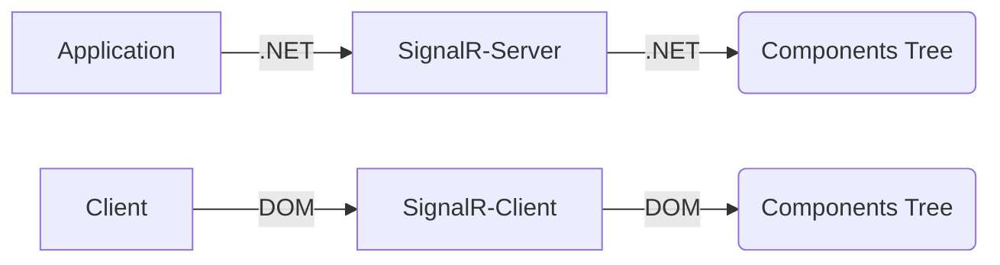

##  RealFlowR, a low code .NET library for RealTime UI

Real time UI interactions using only server side .NET 5 __without touching HTML
or JS__.

#### How it works

After connecting to SignalR, the client has its own unique instance associated
with the server side.

Every server-side operation is replicated on the client side, the trees built in
this way are comparable in number and type and can be defined as "mirrored".

The client is reduced to a passive tool that reacts to commands from the server
by building the UI or reacting to actions performed by the user.

Client-side operations are performed at a low level in the DOM, using

In this way we can work at a high level focusing on the single server-side
element as an object that talks to itself through SignalR.

